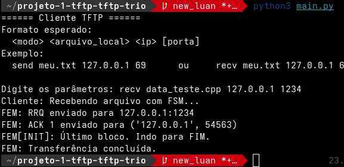

# Projeto1: TFTP

Para a unidade 1 da disciplina de Projeto de Protocolos, a tarefa é a implementação do protocolo de aplicação TFTP, seguindo sua especificação contida na RFC 1350. Durante este projeto, os conceitos estudados serão aplicados para que, ao final, se obtenha um protocolo funcional e consistente com a especificação.

Há dois objetivos específicos para esse trabalho:
* **Desenvolver uma biblioteca TFTP**: o cliente do protocolo TFTP deve ser feito na forma de uma biblioteca, de forma que possa ser reutilizado em aplicações que precisem desse protocolo.
* **Escrever um aplicativo demonstrativo**: usando essa biblioteca, deve-se criar um aplicativo capaz de enviar e receber arquivos usando o protocolo TFTP.

Sua implementação do protocolo TFTP deve ser capaz de se comunicar com um servidor TFTP de referência. Para essa finalidade, será usado um servidor TFTP disponível para o sistema operacional Linux.
* [tftp_server](https://moodle.ifsc.edu.br/mod/resource/view.php?id=185347): um servidor tftp rudimentar feito para este projeto.

## Passo a Passo para execução

Para executar esse projeto, é necessário dois lados: um cliente e outro servidor. 

### Lado servidor:

Para executar esta parte, o professor nos forneceu um servidor tftp de fácil execução. Não é necessário saber como ele é implementado e nem suas especificações, basta rodar que ele irá realizar o manejo das operações.

* **1º passo:** baixar o seguinte arquivo [tftp_server.](https://moodle.ifsc.edu.br/mod/resource/view.php?id=257619)
* **2º passo:** pelo terminal, acessar o diretório onde o arquivo foi baixado e executar o seguinte comando (em SO linux): ```chmod +x tftp_server```
* **3º passo:** executar ```./tftp_server <pasta_contendo_os_arquivos> <porta de comunicação>```.

**Exemplo:** ```./tftp_server /home/your_user/Downloads 1234```

### Lado cliente:

É necessário estar na raiz do diretório principal e ter executado o passo anterior. Logo:

* **1º passo:** dê um git clone no repositório deste projeto.

* **2º passo:** Ainda com o terminal aberto, e dentro do diretório raiz do projeto, digite ```git checkout luan``` para acessar a branch do projeto.

* **3º passo:** Digite ```cd tftp-protocol``` ou para adentrar a pasta principal do projeto.

* **4º passo:** Digite ```python main.py``` ou ```python3 main.py``` para dar início ao serviço API Cliente TFTP, como descrito na imagem abaixo.


## Exemplo de funcionamento

### Send

Com esse protocolo, podemos ter dois tipos de operação: "send" (enviar) e "receive(recv)" (receber).

Um exemplo de envio se encontra na imagem abaixo:


O pacote bruto e o interpretado são apenas checkpoints que deixei para verificar o conteúdo do pacote que o servidor estava enviando. Mas é entendível que o cliente envia a solicitação de escrita para o servidor (WRQ) que responde com o envio dos pacotes (arquivo).

### Receive

Para a recepção, irei mostrar dois exemplos: um para um arquivo menor que 512 bytes e outro maior.

Na imagem abaixo, podemos verificar o processo de recepção. Por ser muito pequeno, ele recebe apenas um ACK e já encerra.



Para o arquivo maior, a única diferença é que há mais ACKs transmitidos para atestar a chegada de cada byte que compõem o arquivo.

