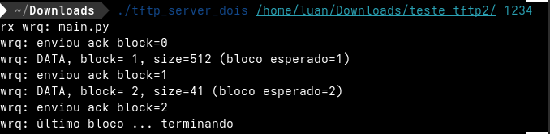
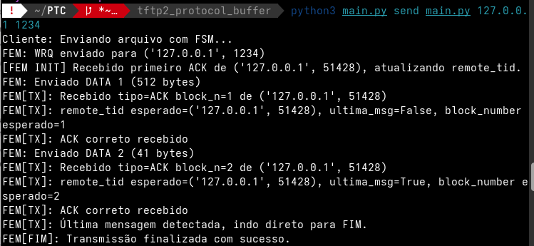
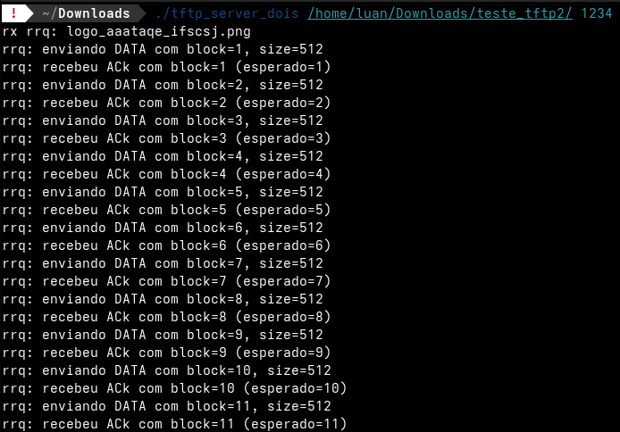
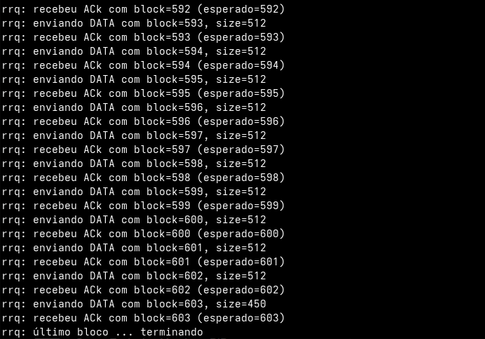
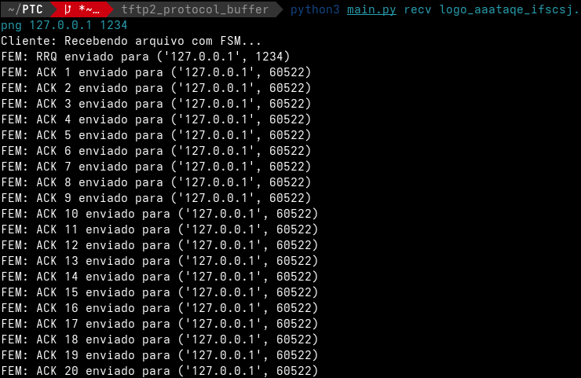
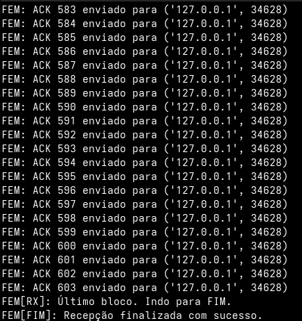

# Projeto2: TFTP2 com ProtocolBuffer

O segundo projeto da disciplina de Projeto de Protocolos, é a implementação do protocolo de aplicação TFTP juntamente com Protocol Buffers. Protocol Buffers é uma tecnologia criada pelo Google para especificar a sintaxe abstrata de tipos de dados e codificá-los de forma eficiente, e com isso guarda semelhanças com ASN.1. Assim como com ASN.1, deve-se compilar uma especificação para que gere código-fonte em alguma linguagem de programação (Python). O código-fonte gerado contém os tipos de dados (ou classes) correspondentes aos tipos declarados na especificação, segundo uma API bem definida.

Já que a bilioteca TFTP foi desenvolvida anteriormente, resta apenas realizar a integração com o Protocol Buffers.

Sua implementação do protocolo TFTP deve ser capaz de se comunicar com um servidor TFTP de referência. Para essa finalidade, será usado um servidor TFTP disponível para o sistema operacional Linux.
* [tftp_server_dois](https://moodle.ifsc.edu.br/pluginfile.php/550465/mod_assign/intro/tftp_server.tgz): um novo servidor tftp2 desenvolvido pelo professor para este projeto.

## Passo a Passo para execução

Para executar esse projeto, é necessário dois lados: um cliente e outro servidor. 

### Lado servidor:

Para executar esta parte, o professor nos forneceu um servidor tftp de fácil execução. Basta rodar que ele irá  manejar as operações.

* **1º passo:** baixar o seguinte arquivo [tftp_server_dois](https://moodle.ifsc.edu.br/pluginfile.php/550465/mod_assign/intro/tftp_server.tgz)
* **2º passo:** pelo terminal, acessar o diretório onde o arquivo foi baixado e executar o seguinte comando (em SO linux): ```chmod +x tftp_server_dois```
* **3º passo:** executar ```./tftp_server_dois <pasta_contendo_os_arquivos> <porta de comunicação>```.

**Exemplo:** ```./tftp_server_dois /home/your_user/Downloads/arquivos_para_trade 1234```

### Lado cliente:

É necessário estar na raiz do diretório principal e ter executado o passo anterior. Logo:

* **1º passo:** dê um git clone no repositório deste projeto através do [link.](https://github.com/mmsobral-croom/projeto-1-tftp-tftp-trio)

* **2º passo:** digite ```cd projeto-1-tftp-tftp-trio/``` para adentrar a pasta principal do projeto.

* **3º passo:** dentro do diretório raiz do projeto, digite ```git checkout luan``` para acessar a branch do projeto.

* **4º passo:** digite ```cd tftp2_protocol_buffer/``` para acessar o diretório principal de execução do projeto.

* **5º passo:** digite ```python main.py``` ou ```python3 main.py``` com o comando de desejo (```send``` - para enviar - ou ```recv``` - para receber), o nome do arquivo (caso ```send```, o arquivo deve constar na pasta de execução do projeto; caso ```recv```, o arquivo deve constar na pasta alvo do servidor TFTP2), o endereço IP e a porta. Para exemplificar:
```bash
python3 main.py send algo.txt 127.0.0.1 3214
```

<!--  -->

## Exemplo de funcionamento

Com esse protocolo, podemos ter dois tipos de operação: "send" (enviar) e "recv" (receber). Abaixo, teremos as demonstrações dos dois tipos.

### Send

Um exemplo de envio se encontra na imagem abaixo:

#### Lado do servidor para recepção de um arquivo



#### Lado do cliente para transmissão de um arquivo



Usamos um arquivo .proto (tftp2.proto) para descrever todas as mensagens do protocolo, como: WRQ (write request), RRQ (read request), etc. E essa é uma das principais diferenças para o projeto anterior, onde essas mensagens haviam sido descritas e especificadas à mão. Agora, o próprio Protocol Buffers já as define para o TFTP poder usar.

### Receive

Para a recepção, o exemplo foi realizado com uma imagem da atlética de nosso campus. Por isso, o print foi recortado para economizar espaço, devido ao arquivo ser um pouco grande.

#### Lado do servidor para transmissão de um arquivo





#### Lado do cliente para recepção de um arquivo





Com essa integração, mantivemos o comportamento essencial do TFTP (envio e recepção de arquivos em blocos de 512 bytes), mas especificamos a estrutura das mensagens trocadas com o servidor usando Protocol Buffers.