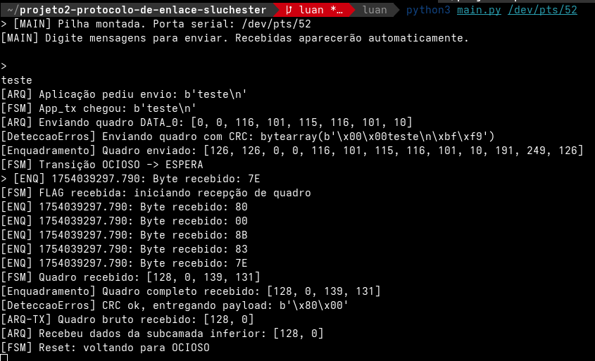
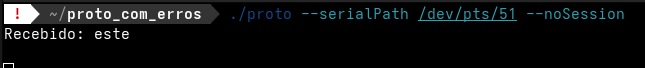
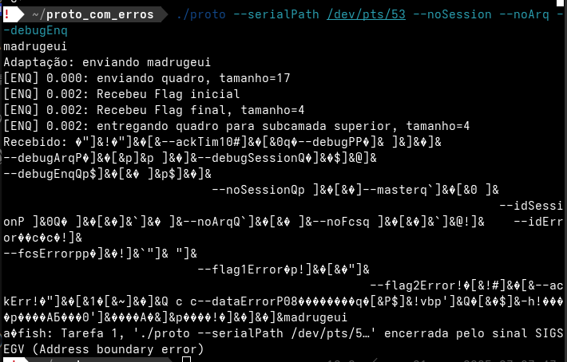
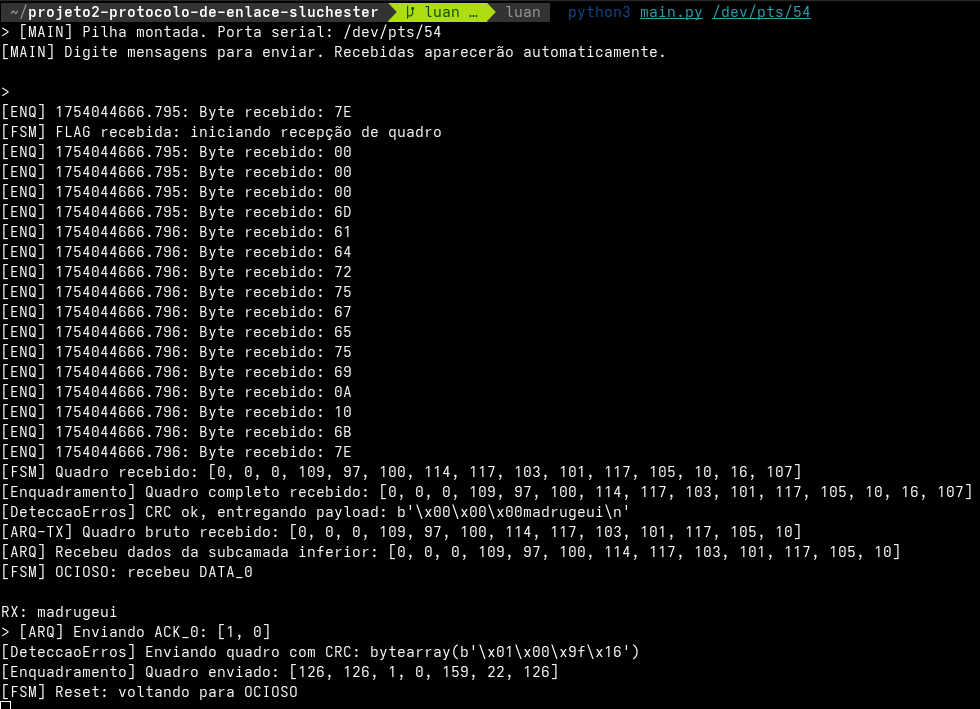

# Projeto2: TFTP2 com ProtocolBuffer

O terceiro projeto da disciplina de Projeto de Protocolos, é a implementação de um protocolo de enlace capaz de conectar e entregar quadros com comunicação bidirecional, retransmitindo-os em caso de erro segundo um mecanismo ARQ pare-espere.

O protocolo é composto por:
* Subcamada de Enquadramento (FSM + Byte Stuffing): delimita quadros com flags e realiza byte stuffing/destuffing.
* Subcamada de Detecção de Erros (CRC-16): gera e verifica erros nos quadros
* Subcamada ARQ Pare-e-Espera (com fila de saída): controle de fluxo, retransmissão, números de sequência e confirmações.

Para efetuar os tester, a implementação de referência do protocolo é fornecida na forma de um programa compilado disponível no link abaixo:
* [versão_com_injeção_de_erros](https://moodle.ifsc.edu.br/pluginfile.php/550497/mod_folder/content/0/Software/proto_com_erros.tgz?forcedownload=1): A implementação de referência do protocolo é fornecida na forma de um programa compilado. O arquivo está compactado com gzip.
* Siga o passo a passo do link acima

## Passo a Passo para execução

Para executar esse projeto, é necessário dois lados: um cliente e outro servidor. 

### Lado servidor:

Para executar esta parte, o professor nos forneceu um programa de fácil execução. Basta rodar o comando ´´´./proto -h que ele irá  mostrar as operações que podem ser feitas.

* **1º passo:** baixar o seguinte arquivo [versão_com_injeção_de_erros](https://moodle.ifsc.edu.br/pluginfile.php/550497/mod_folder/content/0/Software/proto_com_erros.tgz?forcedownload=1)
* **2º passo:** pelo terminal, acessar o diretório onde o arquivo foi baixado e executar o seguinte comando (em SO linux): ```./proto --serialPath /dev/XXX [opções] | -h```


Além disso, é necessário instalar também um emulador de portas seriais virtuais, por onde os protocolos irão se conversar. Basta acessar [este link](https://moodle.ifsc.edu.br/mod/book/view.php?id=257652&chapterid=47891) e seguir o passo a passo.
* Uso: compilar o programa e executar as duas portas que forem fornecidas (mas a frente será mostrado como foi feito na minha execução)

### Lado cliente:

É necessário estar na raiz do diretório principal e ter executado o passo anterior. Logo:

* **1º passo:** dê um git clone no repositório deste projeto através do [link.](https://github.com/mmsobral-croom/projeto2-protocolo-de-enlace-sluchester)

* **2º passo:** digite ```cd projeto2-protocolo-de-enlace-sluchester``` para adentrar a pasta principal do projeto.

* **3º passo:** dentro do diretório raiz do projeto, digite ```git checkout luan``` para acessar a branch do meu projeto.

* **4º passo:** digite ```python main.py``` ou ```python3 main.py``` com a porta serial virtual criada anteriormente.
```bash
Exemplo:  python3 main.py /dev/pts/52
```

## Exemplo de funcionamento

Com esse protocolo, podemos enviar e receber mensagens da serial a qualquer momento, sem ter que ficar selecionando o que fazer. Basta apenas enviar de um terminal, estabelecendo um "sentido".

### Demonstração 1

Um exemplo de envio se encontra na imagem abaixo, onde eu enviei a palavra "teste" e do outro lado apareceu "este".





O erro é visível e acontece para qualquer palavra que for testada. Por algum motivo, na hora de enviar, o programa está comendo o byte da FLAG, ou nesse caso, não lendo esse próximo byte da FLAG.

### Demonstração 2

Já dessa vez, foi feito o envio de uma mensagem do outro lado ("servidor"), por parte do programa compilado, onde 





Podemos perceber que o "servidor" enviou a palavra, mas na hora de receber o ACK e interpretá-lo, ele dá alguma falha de segmentação. Provavelmente porquê a construção do ACK ou do quadro que está sendo feita por parte do servidor está equivocada.

## Conclusão

Não foi possível atender todos os requisitos do projeto, mas foi muito proveitoso construir um protocolo inteiro, do zero, e que simula o atendimento de uma camada de mais baixo nível, bem diferente do que estamos acostumados a trabalhar.